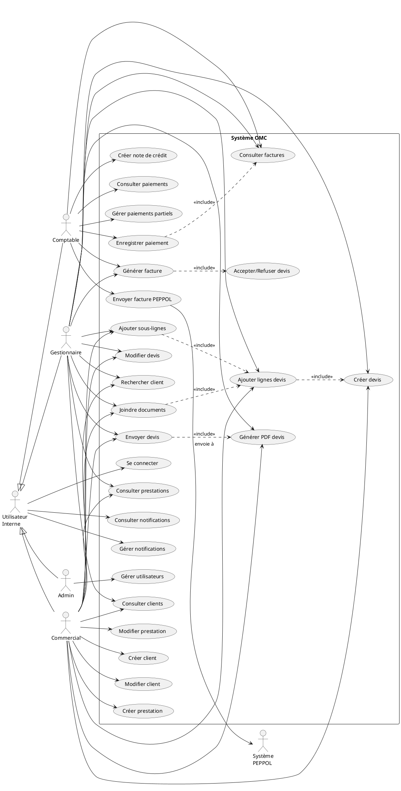

# Diagramme de Cas d'Utilisation - Système OMC

## Description
Ce diagramme présente les différents cas d'utilisation du système OMC selon les rôles des utilisateurs.

## Acteurs principaux

### 1. Admin
- Gestion complète des utilisateurs
- Accès à toutes les fonctionnalités

### 2. Commercial
- Gestion des clients
- Création et gestion des devis
- Gestion des prestations

### 3. Gestionnaire
- Supervision des devis
- Génération des factures
- Consultation globale

### 4. Comptable
- Gestion des factures
- Enregistrement des paiements
- Envoi PEPPOL

## Cas d'utilisation prioritaires

1. **Créer un devis** (UC10)
   - Acteurs: Commercial, Gestionnaire
   - Pré-condition: Client existant
   - Post-condition: Devis créé en statut "brouillon"

2. **Enregistrer un paiement** (UC22)
   - Acteur: Comptable
   - Pré-condition: Facture émise
   - Post-condition: Paiement enregistré, solde mis à jour

3. **Envoyer facture PEPPOL** (UC21)
   - Acteur: Comptable
   - Pré-condition: Facture validée
   - Post-condition: Facture transmise au réseau PEPPOL
