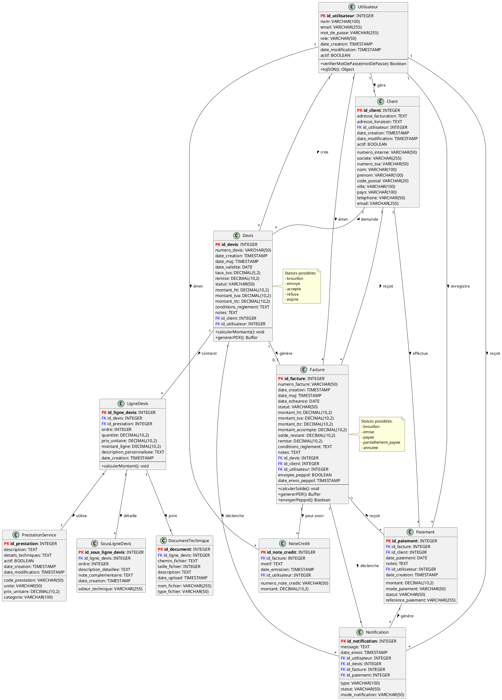

# Diagramme de Classes - Système OMC

## Vue d'ensemble
Ce diagramme présente les classes principales du système et leurs relations.

## Description des classes principales

### Utilisateur
Représente un employé de l'entreprise avec un rôle spécifique (admin, gestionnaire, commercial, comptable).

### Client
Représente un client de l'entreprise (personne physique ou société).

### Devis
Document commercial proposant des prestations à un client avec calcul automatique des montants.

### Facture
Document comptable émis après acceptation d'un devis, avec gestion des paiements et interface PEPPOL.

### Paiement
Enregistrement d'un paiement effectué par un client pour une facture.

## Patterns utilisés

- **Repository Pattern**: Séparation de la logique d'accès aux données
- **Service Layer**: Logique métier centralisée dans les services
- **Factory Pattern**: Génération de PDF et numéros de documents
- **Observer Pattern**: Système de notifications automatiques
