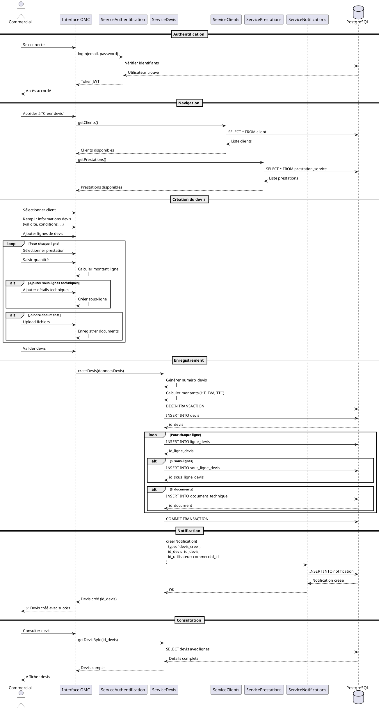

# Diagramme de Séquence - Création d'un Devis

## Scénario: Un commercial crée un nouveau devis pour un client

## Étapes principales

1. **Authentification**: Le commercial se connecte avec ses identifiants
2. **Chargement des données**: Récupération des clients et prestations disponibles
3. **Saisie du devis**: 
   - Sélection du client
   - Ajout de lignes de prestation
   - Ajout de sous-lignes techniques (optionnel)
   - Upload de documents (optionnel)
4. **Calculs automatiques**: Le système calcule les montants (HT, TVA, TTC)
5. **Enregistrement transactionnel**: Tout est enregistré dans une transaction
6. **Notification**: Une notification est créée automatiquement
7. **Confirmation**: Le commercial reçoit la confirmation et peut consulter le devis

## Points importants

- **Transaction atomique**: Tout le devis (lignes, sous-lignes, documents) est créé dans une seule transaction
- **Calculs automatiques**: Les montants sont calculés automatiquement côté backend
- **Numérotation automatique**: Le numéro de devis est généré automatiquement
- **Notifications**: Le système crée automatiquement une notification
- **Validation**: Toutes les données sont validées avant l'enregistrement
